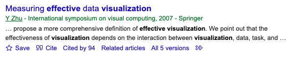

## Relevant Files

Download the following (click to download or right-click > Save File):

- [FYCLibrarySession.Rmd](FYCLibrarySession.Rmd)
- [references.bib](references.bib)
- [apa.csl](apa.csl)
- [nature.csl](nature.csl)

Put all of the files in one folder. Open the Rmd and the bib files in RStudio (you may need to File > Open File > references.bib within RStudio). 

See below for an example of how to cite articles using information in the bib file. Compare the code in Rmd file to the rendered example online.

## Example Article Summary

A recent study was the first to quantify the diversity of artists at U.S. art museums [@heggeseth2019]. 

@heggeseth2013 studied mixture models for clustering longitudinal data and offered an alternative solution when trying to cluster by growth pattern.

Together these studies [@heggeseth2013; @heggeseth2019] were really interesting!

## Your Turn!

1. You write a one sentence summary about one of the articles you found.
2. Go to Google Scholar, search for your article, and Click on Cite (see image below). Click on BibTeX and copy that to your bib file. 

 

3. In your bib file, locate the label for the reference. Look for \@resourcetype{label,...  The labels for existing references were heggeseth2013 and heggeseth2019.

4. Use the syntax in the examples above to cite YOUR article using YOUR label in YOUR one sentence summary. 

> Summary Sentence: 

## More Details about Citations

At the top of the Rmd file, you'll see `bibliography: references.bib` and `csl: apa.csl`. 

### Bibtex

The file name `references.bib` refers to the [Bibtex](http://www.bibtex.org/) file that I created to include all relevant "data" about references I used in a piece of writing (the summary above).

Open the file `references.bib`. Note the general structure of the file. It is made up of a variety of entries. Each entry in the file refers to a single reference and starts with the type of publication after the `@` symbol (e.g., `@article`, `@book`, `@inproceedings`) and ends with `}`.

An entry consists of: 

- type of publication (word after `@`)
- citation key (first word after `{`)
- number of tags which define characteristics of the reference (e.g. title, author, journal, year, etc.) separated by commas

### CSL Files

The file name `apa.csl` refers to a citation style language file for the APA citation style. There are many citation styles (see [Library Guide](https://libguides.macalester.edu/citation)). All of these styles are different ways of organizing, formatting, and visualizing the data about a reference. 

It is incredibly hard to keep track of all of the styles (e.g. where do I put commas vs. periods?!). If you store the data about references in a standard format using a tool such as a Bibtex file or [Zotero](https://libguides.macalester.edu/c.php?g=525380&p=6908726), then you can use CSL files to do the styling for you.

Try changing `apa.csl` to `nature.csl` in the top of the Rmd file and press Render. This will change the citation and bibliography style to the style used in the journal Nature. Notice similarities and differences.

There is an open source repository of many CSL files available at [https://github.com/citation-style-language/documentation](https://github.com/citation-style-language/documentation)

### More information about citations in RStudio

For more information about doing references and citations in Rmd or Quarto, see [link here](https://quarto.org/docs/authoring/footnotes-and-citations.html).

## References

